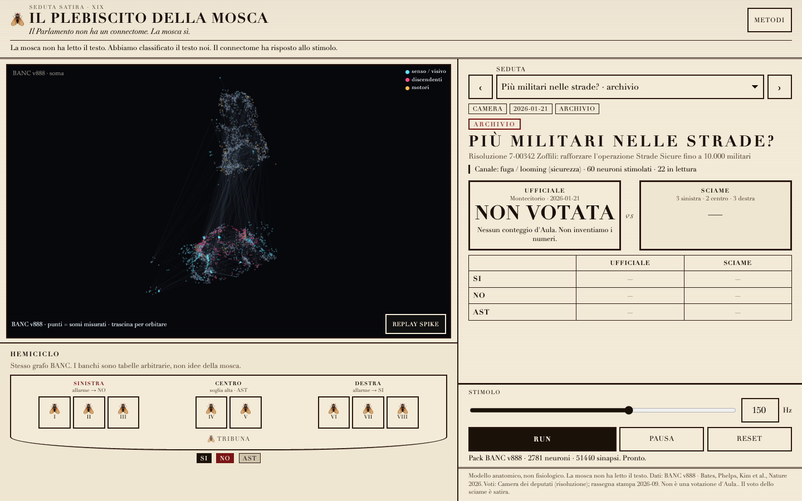

# Il Plebiscito della Mosca

[](https://github.com/dcbert/plebiscito-della-mosca/actions/workflows/ci.yml)
[](LICENSE)

> Il Parlamento non ha un connectome. La mosca sì.

Satirical web app: we classify an Italian XIX-legislatura motion into a sensory bucket, poke a real **BANC v888** fruit-fly circuit, and let eight flies vote SI / NO / ASTENUTA. The fly never reads the bill.

**[Live demo](https://dcbert.github.io/plebiscito-della-mosca/)** · [How a vote happens](#how-a-vote-happens) · [Lab notes](REPORT.md)



## What this is

A broadsheet UI around a small, honest pipeline:

1. Official text in, from Openpolis / Camera / Senato. Counts are copied, never invented.
2. A **hardcoded** Italian keyword list picks a sensory channel (`escape`, `sugar`, `bitter`, `fermentation`, `mechano`) — or `none`. No LLM on SI/NO.
3. Identified BANC neurons for that channel are stimulated with Poisson spikes. A leaky integrate-and-fire model (Shiu et al. 2024 constants) runs in a Web Worker.
4. Motor / descending Δrate is decoded with an **arbitrary table** (shown in Metodi). Same graph, three benches, a fresh seed every Run. Silence → ASTENUTA.

It is a joke with units. It is also a real 2 781-neuron cut of a public connectome.

## What this is not

- Not walking, not flying, not a government, not an endorsement.
- Not a physiological BANC model. Shiu 2024 LIF constants on a BANC edgelist are **not** a validated BANC simulation. Swapping the edgelist ≠ FAFB physiology.
- No party logos, no fake Gazzetta, no portraits.
- Buckets the cut cannot drive (bitter, fermentation in the default pack) **abstain**. We do not invent synapses.

## Quick start

Needs Node 20+. The browser pack (~180 KB gzip) and vote feed are in the repo.

```bash
npm install
npm run dev
```

Open the URL Vite prints (default <http://localhost:5173>).

Pick a seduta → **Run** → watch the hemicycle. **Metodi** has the pack, the LIF constants, and the decoder.

One-shot with pack/vote rebuild (Python 3.10+, ~400 MB the first time for BANC feathers):

```bash
make preview
```

## How a vote happens

```
title + description
        │
        ▼
 hardcoded classifier ── unsure / tasse / procedurale ──► ASTENUTA
        │
        ▼
 BANC stim roots  ×  Poisson Hz  ×  400 ms LIF
        │
        ▼
 readout motors / DNs  →  Δrate (baseline is 0 Hz)
        │
        ▼
 8 seats (3 sinistra · 2 centro · 3 destra)
 each jittered from the Run seed: Hz, gain, soglia, which cells, ~1/4 rebel
        │
        ▼
 majority of 8 · SI/NO tie → ASTENUTA
```

Share URLs keep `?s=` seduta, `?hz=`, `?seed=` so a Run is replayable.

First-loop teaching example: **Più militari nelle strade?** → `escape` (LPLC2 / LC4 / giant fibre). That risoluzione had no electronic floor vote, so the official side is `archivio` / non votata — we do not invent a tally.

## Data

| What | Where | License |
|---|---|---|
| BANC v888 meta + edgelist | [GCS](https://storage.googleapis.com/lee-lab_brain-and-nerve-cord-fly-connectome/compiled_data/banc_888/) · [Dataverse](https://doi.org/10.7910/DVN/7WTH1N) | CC BY 4.0 |
| Paper | Bates, Phelps, Kim, Yang et al., *Nature* 2026 | [doi:10.1038/s41586-026-10735-w](https://doi.org/10.1038/s41586-026-10735-w) |
| LIF defaults | Shiu et al., *Nature* 2024 · [model.py](https://github.com/philshiu/Drosophila_brain_model) | see upstream |
| Votes | [Openpolis](https://service.opdm.openpolis.io/api-openparlamento/v1/19/votings/) · Camera / Senato open data | attribution / CC BY |
| This software | this repo | MIT |

Materialization **888**, snapshot 2026-04-16. Root IDs are uint64 strings, never coerced to float.

Default pack: **2 781 neurons, 51 440 edges**, BFS 2 hops, synapse cutoff ≥ 5. Rebuild:

```bash
make packs    # downloads feathers into data/cache/ (gitignored) if missing
make votes    # refreshes data/sessions.json + app/public/sessions.json
```

If the BANC download fails, the builder writes a schema-compatible **NOT BANC** stub and the UI is stamped. Do not publish that stub as BANC.

Circuit IDs, smoke Hz, and which buckets abstained: **[REPORT.md](REPORT.md)**.

## Repo layout

```
app/                 Vite app (vanilla TS)
  public/packs/      gzip circuit + manifest, ready to serve
  src/engine/        pack decoder + Shiu LIF + worker
scripts/build_pack.py
scripts/ingest_votes.py
```

Public engine shape:

```ts
const brain = await BancLif.load({ pack, seed });
brain.stimulate(rootIds, hz);
const run = brain.run(ms);
brain.rate(rootIds);
```

## License

[MIT](LICENSE) for the code. BANC data remains CC BY 4.0 — cite Bates et al. 2026 if you use the pack. See [NOTICE](NOTICE) and [CITATION.cff](CITATION.cff).

Not affiliated with BANC, FlyWire, Camera, Senato, or Openpolis. The vote of the swarm is satire.

## GitHub Pages

The `Pages` workflow publishes `dist/` to the [live demo](https://dcbert.github.io/plebiscito-della-mosca/). Once, in the repo: **Settings → Pages → Source: GitHub Actions**.
